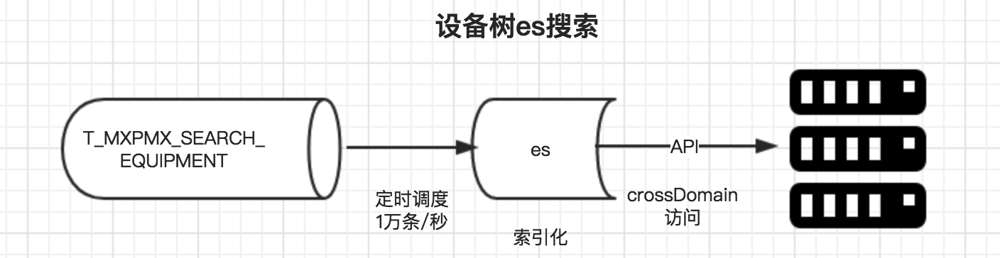

# 设备树缓存方案

### 总体设计

#### 关键接口

###### 初始化

支持种类

基于设备台账树(不包括资产、缺陷等树)

数据源

定时调度入表 		每天23:00

定时调度 全量重新索引 每天23:30

	select *  from t_mxpms_search_equipment   connect by (prior oid) = pid

##### API

功能点		 			|备注           | 日期|
------------ 			|:-------------:| :------------:|
开关值    |    ES_EQUIPMENT_SEARCH_API_URL           | 
TOKEN    |    ES_EQUIPMENT_SEARCH_ID_TOKEN           | 
    

##### 反向索引的过程

#### 数据同步流程 （全量、初始化）

1. 初始化时将设备数据放到T_MXPMS_SEARCH_EQUIPMENT表中(组织单位编码)
2. 设备ID为唯一索引
3. es通过调度任务将上表数据放入内存中生成索引 (索引化速度为:1万条每秒)

#### 应用场景

#### 配置启用开关

为了达到灵活启用、关闭此项功能,方便运维,把升级过程中引入的新技术体系的风险降到最低。

在系统参数表中配置 es-search-equipment159 true 表示缓存查询松江供电公司设备树功能开启。

在系统参数表中配置 es-search-equipment159 false,或者删除此条数据。 表示缓存查询松江供电公司设备树功能关闭走原有逻辑。

#### 部署方案

*	单节点
	
	es 部署为单节点。不需要开启其分片模式。

#### 硬件

#### 软件版本

*	CentOS Linux release 7.3.1611 (Core)
*	jdk 1.8.0_131
*	elasticsearch-5.4.0
*	logstash-5.4.0	

#### API

###### 查询:

	//例 按名称高亮查询
	var url = 'http://172.16.223.185:9200/equipment/unit/_search';
	var query ={"size":100,"query":{"match_phrase":{"na 	me":"交流"},"highlight":{"fields":{"name":{}}}}}

	$.ajax({
        type:"post",
        url: url,
        crossDomain:true,
        async:false,
        dataType:"json",
        data:JSON.stringify(query),
        success:function(data){
            console.log("length="+JSON.stringify(data.hits));
            var hits = data.hits;
            $("#outputHighlight").html("");
            for(var i=0;i<hits.hits.length;i++){
                $("#outputHighlight").append(hits.hits[i].highlight.name[0]+" ");
                console.log(hits.hits[i].highlight.name);
            }            
        },
        error:function(){
            alert("error");
        }
    })
    
###### 更新:

	//例 更新设备名称
	var url = "http://nari_185:9200/equipment/unit/"+$("#edit_index_id").val()+"/_update"
	var query = JSON.parse('{"doc" : {"name":"'+v+'"}}');
	
	$.ajax({
        type:"post",
        url: url,
        crossDomain:true,
        async:false,
        dataType:"json",
        data:JSON.stringify(query),
        success:function(data){
            alert("修改成功 刷新")
        }
    })    
    
### 问题  

功能点		 			|备注           | 日期|
------------ 			|:-------------:| :------------:|
单次插入100万条数据时并发操作    |               | 8.1
BULK API 新增    |          批量操作     | 8.1
BULK API 更新    |          批量操作     | 8.1
用例    |          添加设备、设备版本     | 8.1
设备域索引的设计    |               | 7.31
索引检测    | 方便运维              | 7.31
基于缓存取    | 能提供的功能非常简单，不支持非常复杂的SQL              | 7.31
手动同步    | 右侧同步树定位不到              | 7.31
手动同步    | 资产性质(省公司、子公司、用户)              | 7.31
手动同步    | 基础字段(电压等级、维护班组)              | 7.31
手动同步    | 各级节点个数统计(在后面加个数)、校验              | 7.31
手动同步    | 日志输出              | 7.31
手动同步    | 右边树排序              | 7.31
确保	ID唯一	| 已解决。  			| 6.5
表数据要加上组织编码类似 001002003	| 未解决。  			| 6.2
表同步时间为 23:45,北京时区	| 未解决。  			| 6.2
10万、100万级数据量定时调度测试	| 未开始。  			| 6.8
