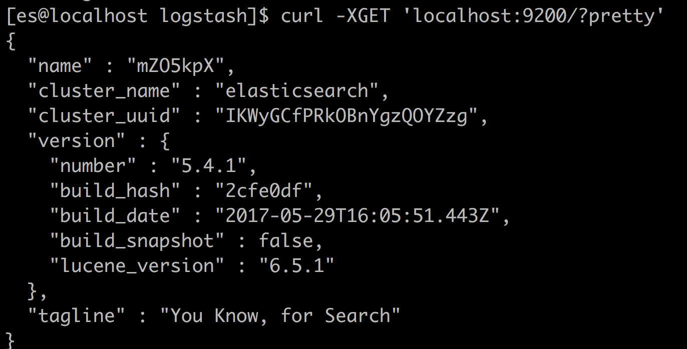
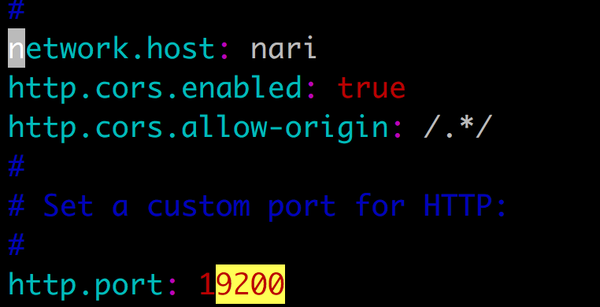
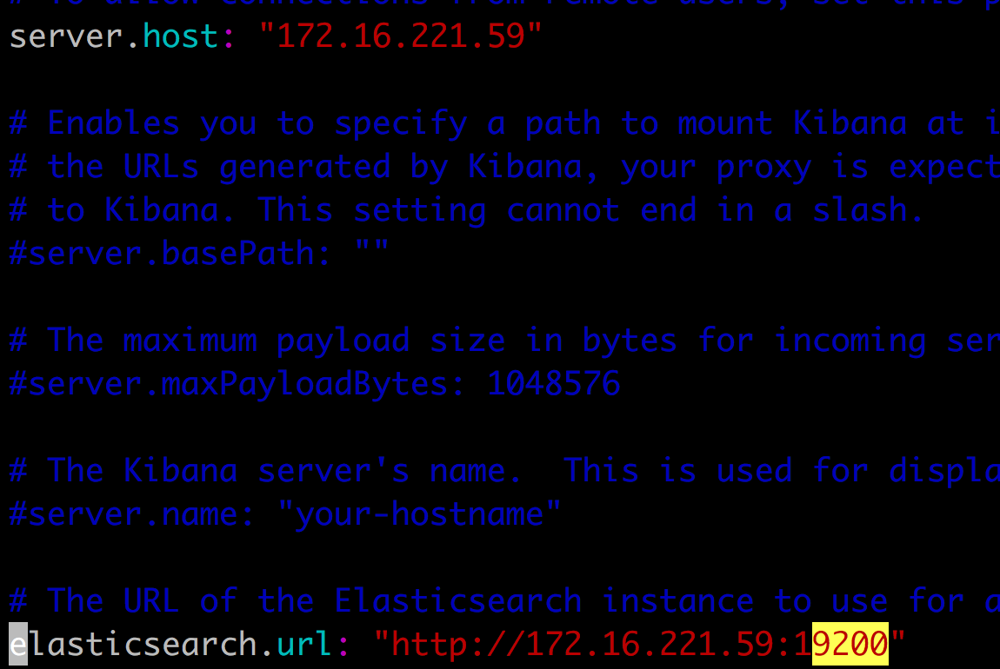
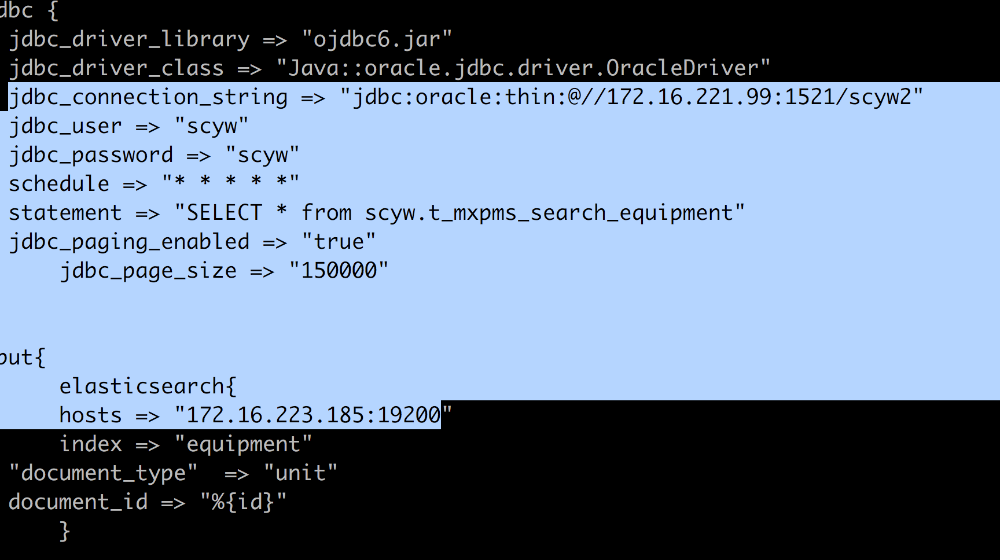
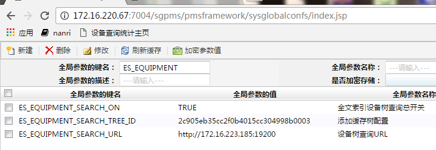

# 设备缓存树安装相关(20170711)

## 1、软件版本

* ReadHat Linux release 7.3.1611 (Core)
* jdk 1.8.0_131
* elasticsearch-5.4.1
* logstash-5.4.1  
* redis3.2.9

## 2、ReadHat es 安装配置

#### 安装JDK1.8.0_131
    
    //检查
    [es@localhost ~]$ java -version
    java version "1.8.0_131"

#### 安装es

##注意:创建用户名为es的用户,自行设置密码，elasticsearch安装以es用户进行。不能以root用户创建。

    sudo rpm --install elasticsearch-5.4.1.rpm

#### ReadHat es常用命令

    sudo -i service elasticsearch start
    sudo -i service elasticsearch stop

    //常用日志位置
    /var/log/elasticsearch/
  
### 检查es服务启动    

    curl -XGET 'localhost:9200/?pretty'

    

    
    
    
## 3、修改es参数    

#### ReadHat es 配置文件

    /etc/elasticsearch/elasticsearch.yml  
    #
    http.cors.enabled: true
    http.cors.allow-origin: /.*/
  
#### vi /etc/elasticsearch/elasticsearch.yml参考设置图



*	host处为IP地址	

## 4、  创建索引 安装kibana:

### 安装kibana

      sudo rpm --install kibana-5.4.1-x86_64.rpm
      sudo -i service kibana start
      sudo -i service kibana stop

### 配置:[es@nari_221_59 ~]$ vi /etc/kibana/kibana.yml



      


### 在web控制台中执行	

	//删除索引
	DELETE equipment
	
	//创建索引
	PUT equipment 
    {
        "mappings": {
            "unit": { 
        "properties": { 
            "id": {
            "type": "keyword",
            "fields": {
              "keyword": {
                "type": "keyword",
                "ignore_above": 256
              }
            }
          }, 
            "name": {
            "type": "text",
            "fields": {
              "keyword": {
                "type": "keyword",
                "ignore_above": 256
              }
            }
          },
            "pid": {
            "type": "keyword",
            "fields": {
              "keyword": {
                "type": "keyword",
                "ignore_above": 256
              }
            }
          },
            "orgid": {
            "type": "keyword",
            "fields": {
              "keyword": {
                "type": "keyword",
                "ignore_above": 256
              }
            }
          }
        }
        }
      }
    }


##### 常用命令参考:删除、查看索引    

    curl -XDELETE 'http://nari_185:9200/equipment?pretty'
    curl 'http://nari_185:9200/_cat/indices?v'

## 5、导入索引    

### 安装 logstash

    sudo rpm --install logstash-5.4.1.rpm

将 安装包中的jdbc_oracle.conf拷入到以下目录并修改
  
#### [es@localhost conf.d]$ vi /etc/logstash/conf.d/jdbc_oracle.conf 参考设置



* 要修改的为数据库IP、端口、用户、密码及es 19200端口号对应的地址
* ojdbc6.jar可以设置为绝对路径

#### ReadHat es同步表到索引

  先执行第6步，保证T_MXPMS_SEARCH_EQUIPMENT中数据已经生成

    sudo /usr/share/logstash/bin/logstash -f /etc/logstash/conf.d/jdbc_oracle.conf
    //其中的 ojdbc.jar指到绝对路径 


## 6、表数据初始化步骤

执行
20170707_设备导航数缓存配置表_DDL.sql、20170707_设备导航树缓存配置项_DML.sql 后

##### 全局参数参考



执行(时间比较长) [http://172.16.220.67:7004/sgpms/pmsframework/rest/pmstreeserviceForRollingForSearch/tree/search/getall/tree](http://172.16.220.67:7004/sgpms/pmsframework/rest/pmstreeserviceForRollingForSearch/tree/search/getall/tree)

## 附录常见错误:

#### 一、[es@localhost rpm]$ vi /var/log/elasticsearch/elasticsearch.log

异常信息:

    java.lang.UnsupportedOperationException: seccomp unavailable: requires kernel 3.5+ with CONFIG_SECCOMP and CONFIG_SECCOMP_FILTER compiled in

解决:

sudo vi /etc/security/limits.conf

    # es config
    soft no file 65536
    hard nofile 131072
    soft proc 2048
    hard nproc 4096  

[参考链接](http://www.cnblogs.com/sloveling/p/elasticsearch.html)

#### 二、 RedHat6.x [es@localhost rpm]$ vi /var/log/elasticsearch/elasticsearch.log

```
[2017-02-02T03:22:24,059][INFO ][o.e.b.BootstrapChecks    ] [2oC8mTv] bound or publishing to a non-loopback or non-link-local address, enforcing bootstrap checks
ERROR: bootstrap checks failed
system call filters failed to install; check the logs and fix your configuration or disable system call filters at your own risk
[2017-02-02T03:22:24,078][INFO ][o.e.n.Node               ] [2oC8mTv] stopping ...
[2017-02-02T03:22:24,109][INFO ][o.e.n.Node               ] [2oC8mTv] stopped
[2017-02-02T03:22:24,109][INFO ][o.e.n.Node               ] [2oC8mTv] closing ...
[2017-02-02T03:22:24,126][INFO ][o.e.n.Node               ] [2oC8mTv] closed

```  
##### 解决
    
vi /etc/elasticsearch/elasticsearch.yml 解注释以下(注意顺序)

bootstrap.memory_lock: false

bootstrap.system_call_filter: false