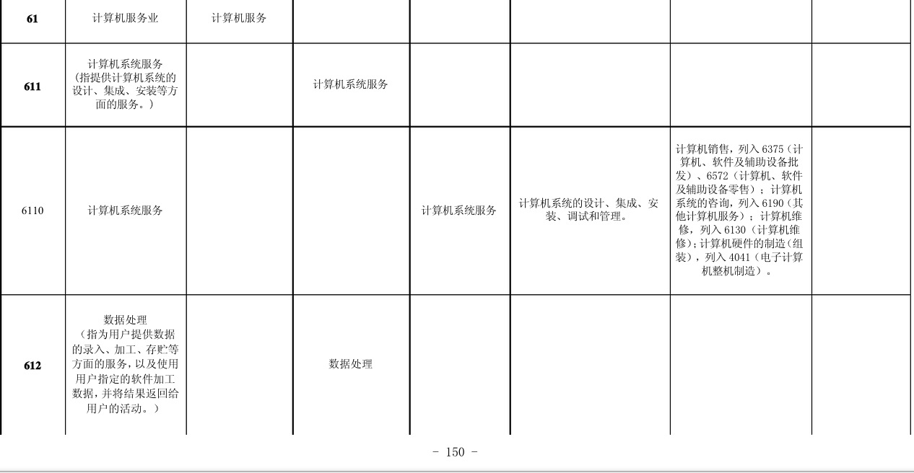
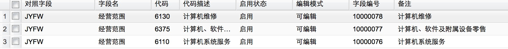
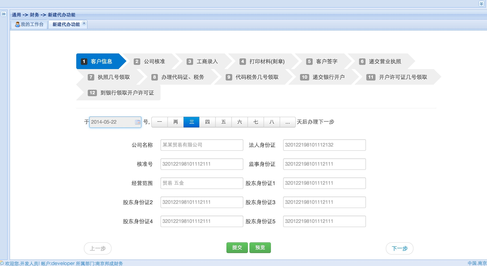
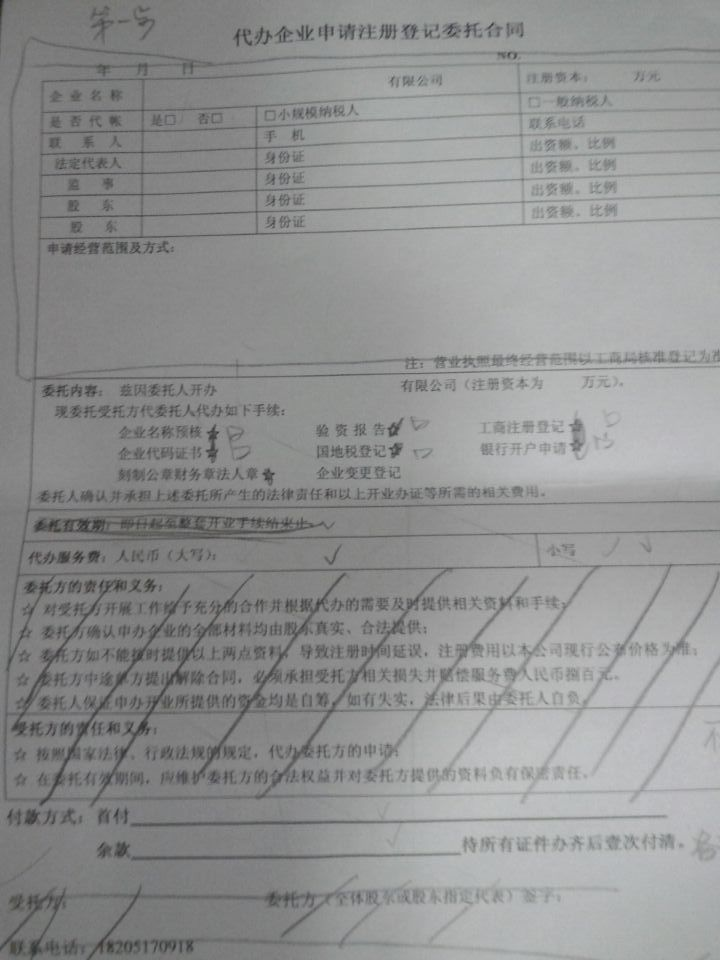
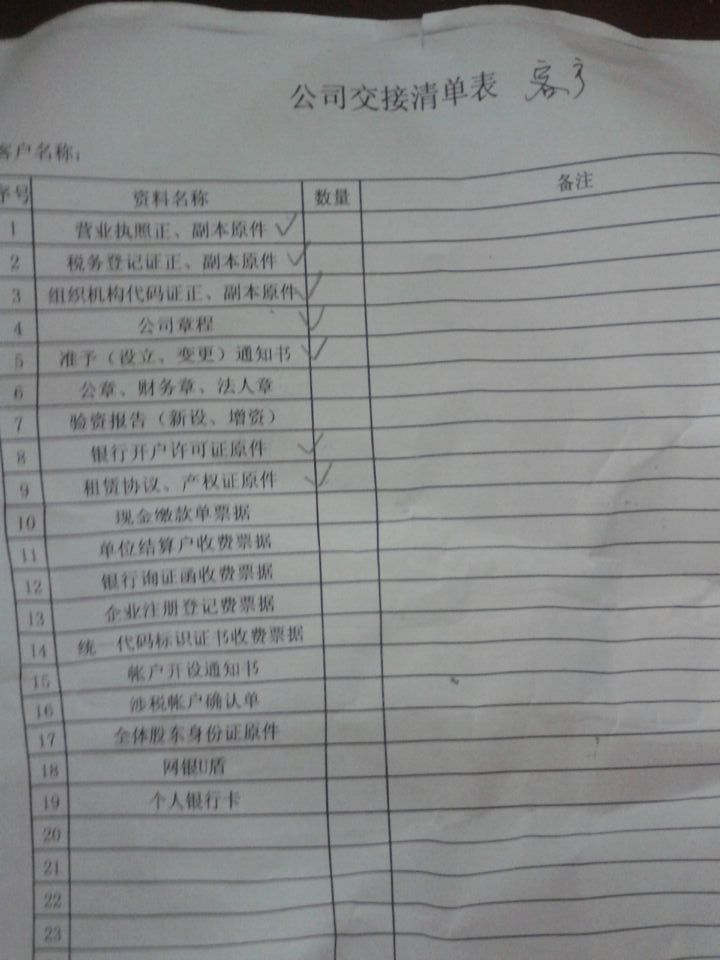

###系统介绍

	本系统为公司注册case的每一位负责、经办人员。掌握好各步骤的时间点。将每步的流程涉及的表单电子化、生成word文档、并记录操作过程。

#####企业注册新增

	企业注册新增的每一步骤 可以设置下一步的日期，并在"我的工作台"中显示代办天数。
	每一步骤自动带入于多少号(某天)的时间间隔。每一步骤的时间间隔取字典表XJJG字段的备注值。

由于界面布局复杂的原因列表页面和新增(编辑)页面是分别设置为两个菜单的形式展现。

#####企业注册变更

	与上面功能有几个步骤有变化

#####我的工作台

	以上两步骤的到期预警等提示。

#####日历功能

	以日历的形式展现上面的数据

####word文档生成

	打印交接给客户的交接文档(case完成) 见底部附件,委托合同、交接清单
	
####环节日期设置
	
	每部环节的默认时间，在此设置。
	

###技术结构

####UI
列表页面用jqgrid，按照163邮箱的列表风格进行优化css。
jqgrid改造项
	
	行高度、字体大小、按钮的布局方式	

canladar日历组件
	

####中间件

aspose组件、FTP服务器

gitlib（实现痕迹管理 有点难度）

[演示地址](http://23.88.238.141:8080/pms/login.do?reqCode=init)

####字典值
	经营范围 字典值	
	

###2014-6-18
1. 登录人员姓名清单
2. 企业经营范围是字典值，最好能提供码表。其他码表一并汇总提供（参考数据如下）
3. 

[经营范围参考值 百度文档链接](http://wenku.baidu.com/link?url=FMkNapE4v6eGbpIcxCKg39ifUaN8JO66QhPzuYjGBChAoAmiKjoDRcdiw1OtEllIdTQSuCMax_0abfsLR_bqXC-nPlr0sI2BPVCYJFWSur3)

###概要图2014-5-18

